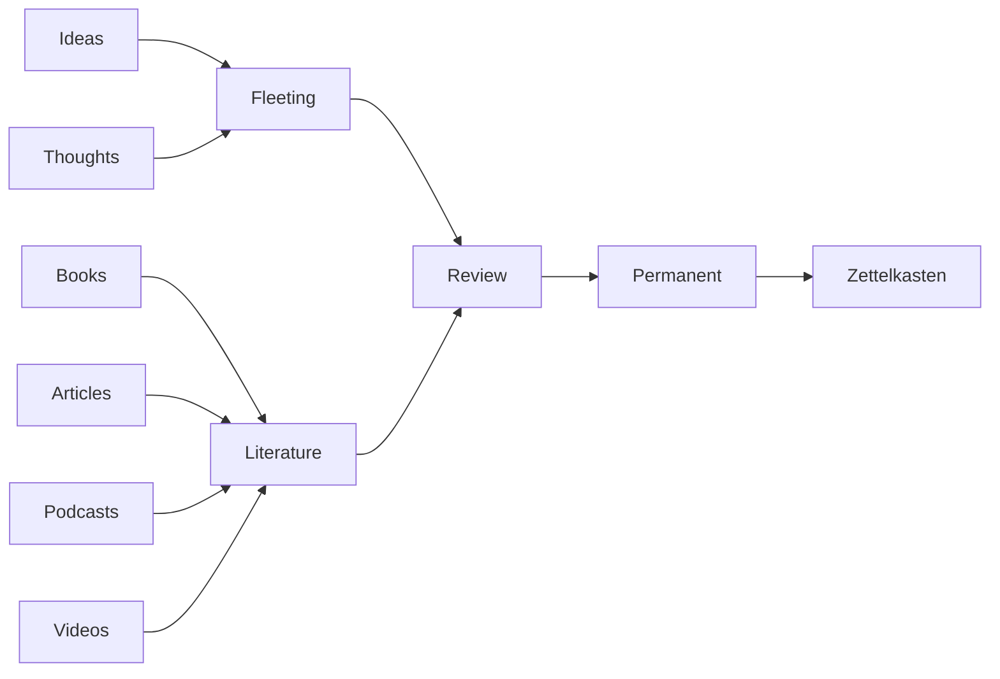

# Zettelkasten Organizer

[](LICENSE)
[](https://github.com/lofisons/zettelkasten-organizer-skill/releases)
[](https://github.com/lofisons/zettelkasten-organizer-skill)
[](#installation)
[](#installation)
[](#installation)
[](#installation)
[](#installation)
[](#installation)



A portable skill that turns an AI agent into a Zettelkasten assistant — **native to Obsidian**. It audits, maintains, improves, and sets up a slip-box note system in your vault: orphaned notes found, inbox processed, atomic permanent notes written with real links.

The method is the one developed by sociologist **Niklas Luhmann** (roughly 90,000 cards, 70+ books) and popularized by **Sönke Ahrens** in *How to Take Smart Notes*. Its core insight: the value of a note system is not in collecting notes but in the network of connections between them. **Folders organize; links think.**

## What the skill does

Four modes of use, ordered by how often you'll need them:

| Mode | What it does |
|---|---|
| **Audit & maintenance** | The primary mode: finds orphaned notes, dense clusters, atomicity violations, inbox debt, bare links — with concrete Dataview queries and graph-view checks |
| **Review (process the inbox)** | The Review step: triages fleeting notes (Daily Notes journal or Inbox folder) — archive, file as bib, or distill into atomic permanent notes |
| **Capture a source** | Files an external source (article, book, podcast, video) directly as a bib note, paraphrased with its full reference — the other entry stream |
| **New permanent note** | Drafts one atomic note with you: statement title, your own words, links with stated reasons |
| **Initial setup** | Builds the structure from scratch: flat layout by default (`type` property, statement titles as filenames), containerized if you prefer visible folders |

Safety is built in: the skill **never creates, moves, splits, or deletes a real note until it has presented a complete written plan and you have approved it.** The ceremony scales — structural changes get the full plan, an obvious triage gets a one-line confirmation.

## The method in 30 seconds

- **Fleeting notes** — quick captures of ideas. Raw material, processed within days. In Obsidian, your Daily Notes journal can be the inbox.
- **Bib notes** — what a source says, paraphrased in your own words, with the full reference. They are also called literature notes.
- **Permanent notes** — the heart of the system. One idea per note (atomic), titled with a **statement** ("Writing externalizes thought", not "Writing"), and densely **linked** — every link carrying a line that explains *why* the notes connect.
- **Operational material stays out.** The skill is about knowledge, not task management: drafts, tasks, and project files live wherever you work — only the durable ideas from that work enter the slip-box as permanent notes.
- **Archive** — where processed and discarded notes rest. Nothing is ever deleted.

## Obsidian-native conventions

The skill speaks Obsidian: **flat layout** (one folder, `type` property, no per-kind folders), **statement titles as filenames** (no timestamp IDs — links resolve by name), **Daily Notes** as the inbox, **Unlinked mentions** to grow the network, and **Dataview queries** that make the audit mode concrete.

## Installation

The folder `zettelkasten-organizer/` is self-contained — no dependencies, no build step. Copy it to your agent's skills directory. The same folder works everywhere; the frontmatter carries both the Anthropic agent-skills convention and the Hermes convention.

| Agent | Install command |
|---|---|
| **Claude Code** | `cp -r zettelkasten-organizer ~/.claude/skills/` |
| **Hermes Agent** | `cp -r zettelkasten-organizer ~/.hermes/skills/note-taking/` |
| **OpenCode** | `cp -r zettelkasten-organizer ~/.config/opencode/skills/` (global) or `.opencode/skills/` (project) |
| **OpenAI Codex** | `cp -r zettelkasten-organizer ~/.codex/skills/` (global) or `.codex/skills/` (project) |
| **Gemini CLI** | `cp -r zettelkasten-organizer .gemini/skills/` (workspace) |

Paths verified against each tool's documentation; `.agents/skills/` also works as a shared alias in OpenCode and Gemini CLI. After installing, start a new session so the skill loader picks it up.

## Usage

Once installed, just talk to your agent. Example triggers:

- "Audit my note system" / "Find orphaned notes in my vault"
- "Process my notes inbox"
- "Help me write a permanent note about this idea: …"
- "Organize my notes with links instead of folders"
- "Set up a Zettelkasten for my notes"

The agent locates your vault (or you point it at the folder), confirms the mapping, and never touches a note until you've approved the plan.

## Repository structure

```
zettelkasten-organizer-skill/
├── README.md                          ← you are here
├── LICENSE                            ← MIT
├── zettelkasten-organizer/            ← the skill (this folder is what you install)
│   ├── SKILL.md                       ← skill definition: frontmatter + workflow
│   ├── icon.svg
│   └── references/
│       ├── zettelkasten-framework.md  ← the method: note types, atomicity, linking rules
│       ├── obsidian.md                ← Obsidian mechanics: layout, Dataview audit queries, plugins
│       └── note-templates.md          ← templates for every note type
└── examples/
    └── mini-zettelkasten/             ← a tiny working Zettelkasten produced by the skill
```

## The mini example

[`examples/mini-zettelkasten/`](examples/mini-zettelkasten/) is a complete, tiny Zettelkasten — 6 notes showing the pipeline: one unprocessed fleeting note in the inbox, one bib note, three atomic permanent notes linked to each other, and one archived fleeting note. Open the folder as a vault in Obsidian to follow the links — the graph view is the point. The skill's audit queries work against it as-is.

## License

[MIT](LICENSE) © 2026 [absolute-duckdev](https://github.com/absolute-duckdev)

## Credits

- **Niklas Luhmann** — the original Zettelkasten method
- **Sönke Ahrens** — *How to Take Smart Notes* (2017), the modern formulation this skill follows
